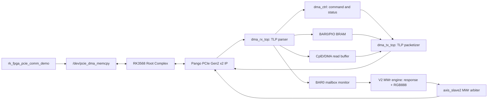

# PCIe DMA/PIO + RGB888 V2 Architecture

## Top-Level Partition

## RTL Boundary

- `pcie_dma_test_100h_top` is the project top wrapper.
- `pcie_dma_test` is the vendor reference top and remains unchanged.
- `pcie_test` is the generated PCIe IP wrapper.
- `ips2l_pcie_dma` contains the DMA subsystem.
- `ips2l_pcie_dma_rx_top` parses RX TLPs from the PCIe AXI4-Stream master path.
- `ips2l_pcie_dma_controller` owns DMA command decode and status registers.
- `ips2l_pcie_dma_tx_top` sends CplD, Mrd, and Mwr TLPs on the three TX paths.
- `pcie_v2_axis_mwr` observes BAR0 mailbox writes and injects FPGA-initiated
  response/video MWr packets on `axis_slave2`.

The wrapper now exposes `txd/rxd` for the external `uart2apb` configuration
path required by the experiment manual.

## V2 Implementation Mapping

The implementation intentionally keeps the vendor integration top intact for
bring-up. The logical blocks map to the current RTL as:

| Logical block | V1 RTL mapping |
| --- | --- |
| `pcie_ip_wrap` | `pcie_dma_test.u_ips2l_pcie_wrap`, instance of generated `pcie_test` |
| `pcie_dma_core` | `pcie_dma_test.u_ips2l_pcie_dma`, instance of `ips2l_pcie_dma` |
| `dma_rx_top` | `ips2l_pcie_dma_rx_top` |
| `dma_ctrl` | `ips2l_pcie_dma_controller` |
| `dma_tx_top` | `ips2l_pcie_dma_tx_top` |
| `v2_mailbox_video` | `pcie_dma_test.u_pcie_v2_axis_mwr` |

If later work separates `pcie_ip_wrap` and `pcie_dma_core` into explicit RTL
modules, preserve the external top ports and RK-visible register behavior.

## TLP Rules

- RX accepts posted MWr/IOWr, non-posted MRd/IORd, and Completion with Data.
- TX `axis_slave0` sends CplD responses.
- TX `axis_slave1` sends FPGA-initiated Mrd requests.
- TX `axis_slave2` sends FPGA-initiated Mwr requests.
- The first AXI4-Stream beat is the TLP header.
- `tvalid` must remain asserted from packet start through the beat with `tlast`.
- MWr payload is split according to negotiated Max Payload Size.
- Mrd must not cross a 4 KB boundary.
- V2 video MWr packets are additionally split at 4 KB boundaries.

## V2 Communication Flow

1. RK maps a DMA buffer through the existing driver and writes a 64-byte command
   descriptor to FPGA `BAR0 + 0x000`.
2. FPGA captures the mailbox descriptor while preserving the legacy BAR0 BRAM
   write.
3. FPGA sends a response descriptor to RK DDR using `axis_slave2` MWr.
4. For video mode, FPGA writes each `640x640 RGB888` frame payload to the RK DDR
   ring slot, then writes the frame descriptor at the start of that slot.
5. RK polls descriptors and may dump the RGB888 payload for visual inspection.
